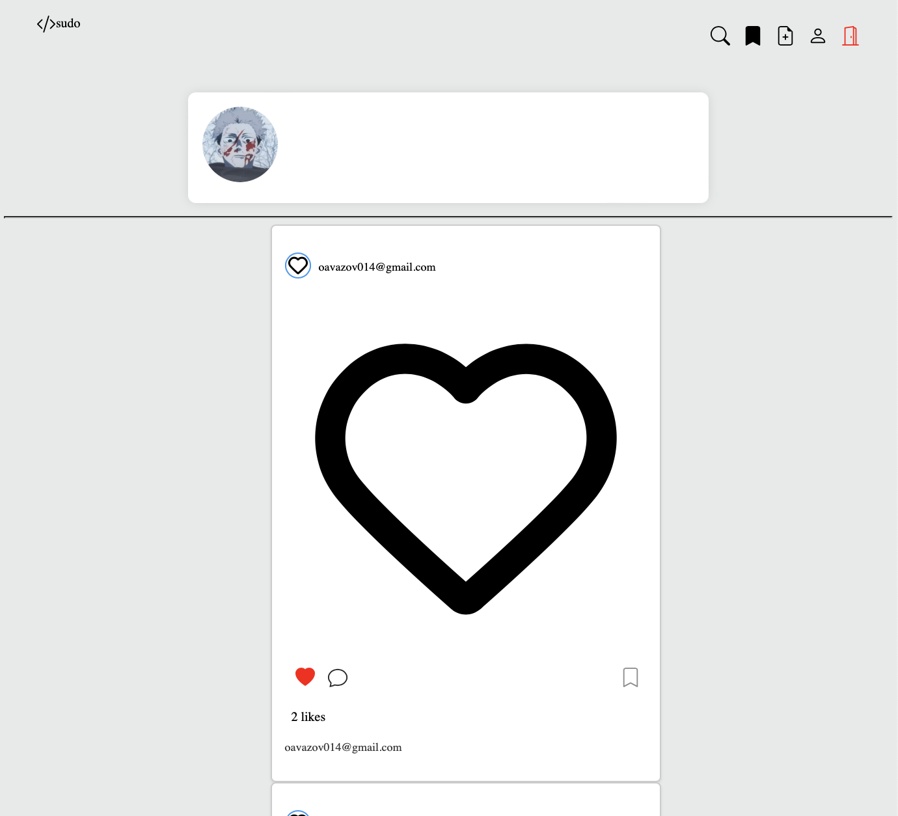

<p align="center">
  
</p>

# [Click here to see more pictures of the site](#site-images)


# Django Social Media Application

Welcome to our Django-based social media application! This platform allows users to create profiles, post content, interact with posts, and connect with other users.

## Table of Contents

- [Overview](#overview)
- [Features](#features)
- [Project Structure](#project-structure)
- [Technologies Used](#technologies-used)
- [Database Configuration](#database-configuration)
- [Email Configuration](#email-configuration)
- [Installation](#installation)
- [Usage](#usage)
- [Deployment](#deployment)
- [Contributing](#contributing)
- [License](#license)
- [Site Images](#site-images)


## Email Configuration

This application uses email functionality for verification purposes. To set up email sending capabilities, follow these steps:

1. **SMTP Configuration:** This application utilizes SMTP (Simple Mail Transfer Protocol) for sending verification codes via email. 

2. **Credentials:** Configure your SMTP settings in the Django project's `.env` file or environment variables. For example:

    ```plaintext
    EMAIL = xxxxxx@gmail.com
    PASSWORD = xxxxxxxx <-- this email app password
    ```

    Please ensure to handle these email credentials securely and do not expose them publicly in version control or public repositories.

3. **Security Note:** For security reasons, avoid hardcoding sensitive information like email credentials directly in the codebase. Consider using environment variables or other secure methods to manage and access these credentials.

## Database Configuration

This Django application supports SQLite as an alternative database backend. If you prefer to use SQLite, no specific configuration changes are required in your `settings.py`. The application is preconfigured to utilize SQLite by default.

To use SQLite:
1. Ensure that Django's default database settings in `settings.py` remain unchanged:

    ```python
    DATABASES = {
        'default': {
            'ENGINE': 'django.db.backends.sqlite3',
            'NAME': BASE_DIR / 'db.sqlite3',
        }
    }
    ```

2. Run the following commands to apply migrations:

    ```bash
    python manage.py makemigrations
    python manage.py migrate
    ```

    This will create the necessary tables in your SQLite database.

## Installation


1. **Clone the Repository:** `git clone https://github.com/yourusername/project-name.git`
2. **Setup Virtual Environment:** `python -m venv myenv`
3. **Activate Virtual Environment:** `source myenv/bin/activate` (Windows: `myenv\Scripts\activate`)
4. **Install Dependencies:** `pip install -r requirements.txt`
5. **Run Migrations:** `python manage.py makemigrations` and `python manage.py migrate`
6. **Set Up Email Configuration:** Add EMAIL and PASSWORD to a `.env` file.
7. **Start the Server:** `python manage.py runserver`

Access the application via `http://127.0.0.1:8000` in your web browser.

## Usage

1. **Create an Account:** Sign up or sign in to access the platform.
2. **Explore Profiles:** Discover other users and their posts.
3. **Interact with Posts:** Like, comment, and save interesting posts.
4. **Profile Customization:** Modify your profile settings and images.
5. **Follow/Unfollow Users:** Connect with other users by following or unfollowing them.

## Deployment

For deployment to a production server, follow these general steps:
- Set up a production-ready database (e.g., PostgreSQL).
- Configure environment variables for production settings.
- Use a secure email service for SMTP (instead of Gmail).
- Set DEBUG to False in production settings.
- Serve static files using a web server like Nginx.

## Contributing

Contributions are welcome! Feel free to open issues or pull requests for improvements, bug fixes, or new features.


# Site Images


<p align="center">
  
</p>
